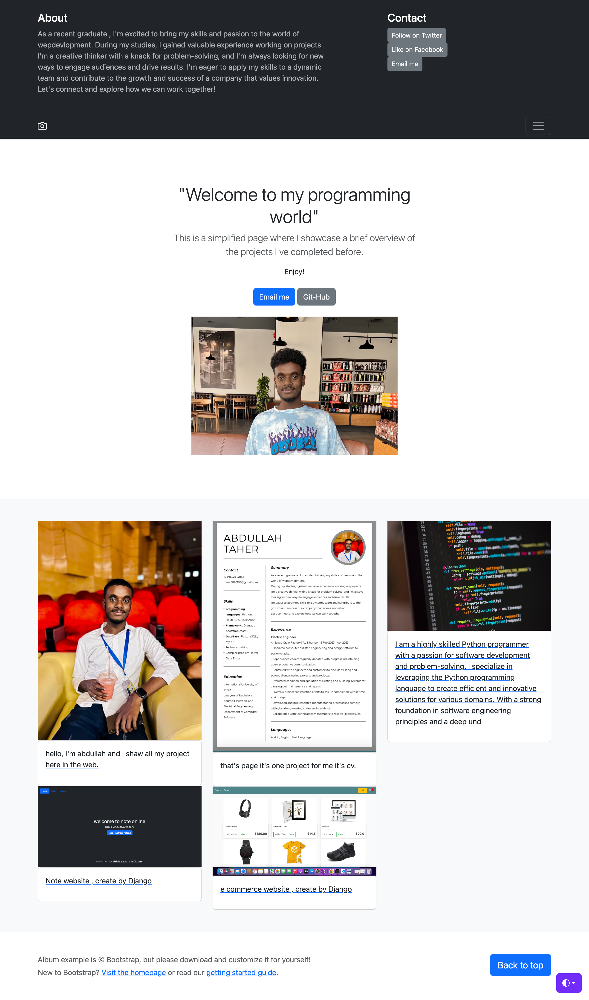

# Portfolio Website

A personal portfolio website created using the Django framework and JavaScript.

## Project Details

- This project was developed using the Django framework along with JavaScript for interactive features.
- It consists of a single Django application.
- The primary focus of the project is on creating function-based views and models.

## Features

- Showcase your portfolio with project details, descriptions, and images.
- Interactive and responsive web design.
- Function-based views for handling different sections of the portfolio.

## Getting Started

To run this project locally, follow these steps:

1. Clone this repository to your local machine:

2. Navigate to the project directory:

3. Create a virtual environment and activate it:

4. Install the project dependencies:

5. Apply the database migrations:

6. Start the development server:

7. Open your web browser and visit http://localhost:8000/ to view your portfolio website.

## Usage

- Update the portfolio content in Django admin or by modifying the models and views to add your own projects and details.
- Customize the JavaScript and CSS to match your design preferences.

## Contributing

If you want to contribute to this project or have any suggestions, feel free to submit issues or pull requests.

## License

This project is licensed under the MIT License - see the [LICENSE](LICENSE) file for details.

<h2>Screenshot of the projects 📸</h2>

<h1>Home Page : 🏡</h1>

<h1>Detail Page : 🎁</h1>

